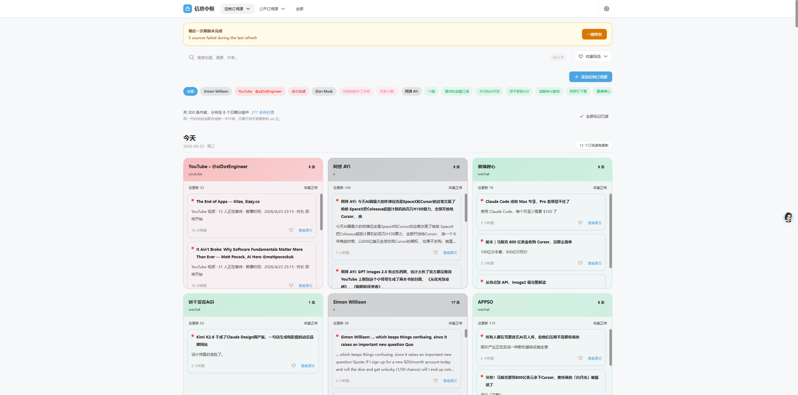
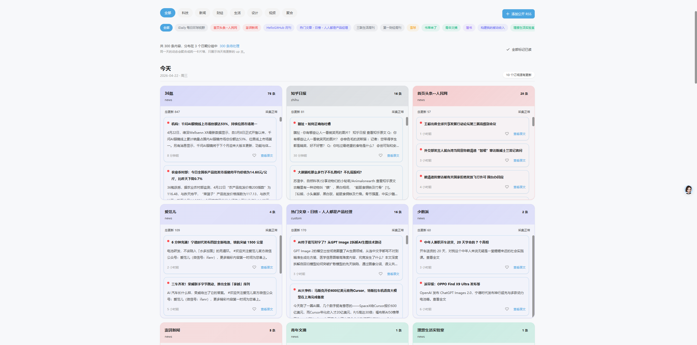
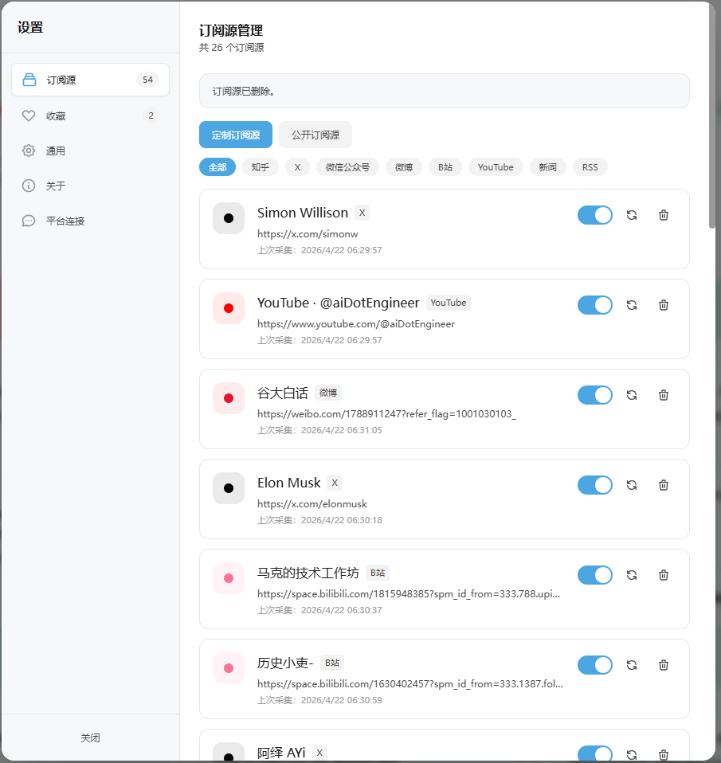

# InfoHub 📡 你的本地订阅中枢

[](https://github.com/Jinkin-92/infohub/stargazers)
[](https://github.com/Jinkin-92/infohub/blob/main/LICENSE)


> 聚合多平台内容，本地部署，数据完全自主






## ✨ 核心亮点

### 🎯 多平台集中追踪
一个界面，追踪所有：
- 📺 **Bilibili** - 订阅UP主，追踪更新
- 𝕏 **X (Twitter)** - 追踪用户/话题
- 💬 **微博** - 追踪博主/超话
- 📚 **知乎** - 追踪回答/文章
- 📖 **微信** - 订阅公众号
- 📕 **小红书** - 追踪笔记/博主
- ▶️ **YouTube** - 订阅频道
- 📡 **RSS** - 接入任意RSS源

### 🏠 本地化部署
- ✅ 数据完全存储在本地，不上云
- ✅ 无订阅费用，无隐私泄露
- ✅ 你的数据你做主

### ⚡ 极简高效
- 🎈 轻量级设计，启动快速
- 🎯 信息流去重，不重复阅读
- 🔄 自动更新，实时追踪
- 📦 开箱即用，预置30+优质RSS源

## 🚀 快速开始

### Windows 用户（推荐）

```bash
# 1. 克隆项目
git clone https://github.com/Jinkin-92/infohub.git
cd infohub

# 2. 一键安装依赖
install.bat

# 3. 启动服务
start.bat

# 4. 打开浏览器访问
# http://localhost:3000
```

### Linux / macOS 用户

```bash
# 1. 克隆项目
git clone https://github.com/Jinkin-92/infohub.git
cd infohub

# 2. 安装依赖
chmod +x start.sh
./start.sh

# 3. 打开浏览器访问
# http://localhost:3000
```

### Docker 部署

```bash
docker-compose up -d
```

## 📖 功能说明

### 定制订阅
管理你的私人订阅源：
- 添加各平台账号/UP主/博主
- 自定义分组和标签
- Cookie免密登录，安全可靠

### 公开RSS
预置30+优质RSS源，开箱即用：
- **技术周刊**: ByteByteGo、Golang Weekly、HackerNews
- **聚合资讯**: 各大科技媒体
- **持续更新中...**

### RSS输出
- 生成自定义RSS链接
- 支持Fluent Reader、Reeder等RSS阅读器
- 无需打开网页，随时阅读

## 🛠 技术栈

| 组件 | 技术 |
|------|------|
| 前端 | Next.js 14 + TailwindCSS |
| 后端 | Hono.js + TypeScript |
| 数据库 | SQLite + PostgreSQL |
| 爬虫 | Puppeteer + RSSHub |
| 部署 | Docker / Windows Bat |

## 📂 项目结构

```
infohub/
├── backend/           # 后端服务
│   ├── src/
│   │   ├── routes/    # API路由
│   │   ├── services/  # 核心服务
│   │   └── db/        # 数据库
│   └── scripts/       # 工具脚本
├── frontend/          # Next.js前端
│   └── app/           # 页面组件
├── docs/              # 文档截图
├── install.bat        # 一键安装
├── start.bat          # 一键启动
├── stop.bat           # 一键停止
└── update.bat         # 一键更新
```

## 🤝 贡献

欢迎提交 Issue 和 Pull Request！

## 📄 License

[MIT License](LICENSE)

---

⭐ 如果觉得有用，请给项目一个Star！
